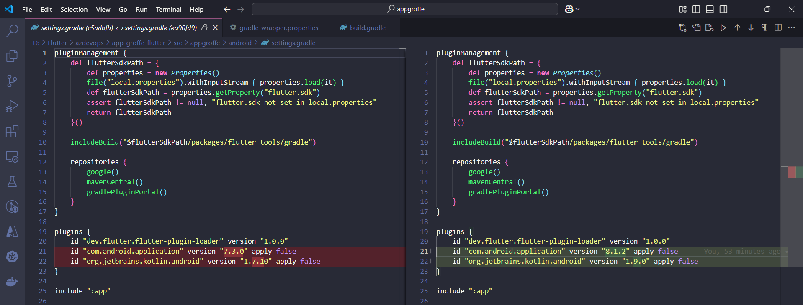
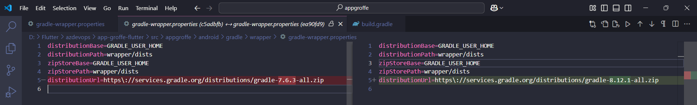
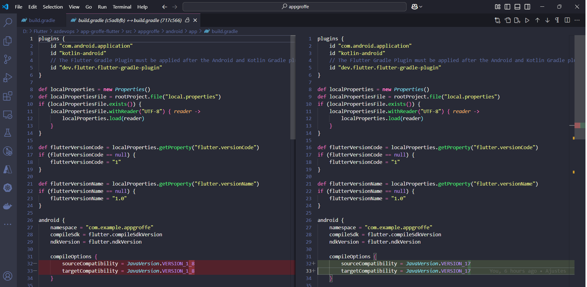

# Flutter-AppContagemClicks
App mobile criado com Flutter para contagem de cliques e exibição do valor correspondente em tela.

---

## Atualizações em 21/02/2024

1) Atalizados packages do projeto com a linha de comando:

```bash
flutter pub upgrade --major-versions
```

2) Alterações no arquivo **/src/appgroffe/android/settings.gradle**:



3) Alterações no arquivo **/src/appgroffe/android/gradle/wrapper/gradle-wrapper.properties**:



4) Alterações no arquivo **/src/appgroffe/android/app/build.gradle**:



